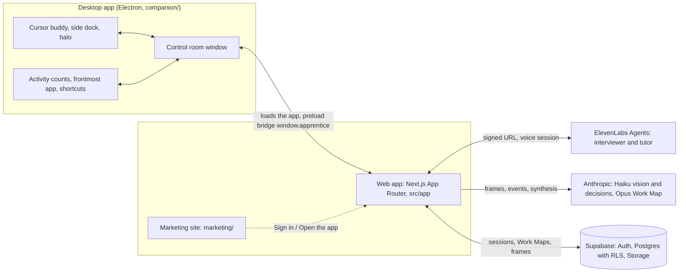

# AI Apprentice

An apprentice, not a recorder. An expert does a real task on their own screen while a voice agent watches and asks *why* at natural pauses. A short spoken debrief closes the gaps and ends with a teach-back the expert confirms. The result is a Work Map that a voice tutor then uses to coach a new hire on a case the expert never showed, stepping in before a guardrail is broken.

Built for the Hack-Nation x ElevenLabs Challenge 01.

- App: https://ai-apprentice-app.vercel.app
- Website: https://ai-apprentice-web.vercel.app
- macOS download: https://github.com/K3NTAW/ai-apprentice-desktop/releases/tag/v0.1.0

## Contents

1. [How it works](#how-it-works)
2. [Architecture](#architecture)
3. [Getting started locally](#getting-started-locally)
4. [Deploy](#deploy)
5. [Trust, privacy and limitations](#trust-privacy-and-limitations)
6. [Roadmap](#roadmap)
7. [Team](#team)

## How it works

```
Capture -> Debrief -> Work Map -> Teach
```

| Stage | What happens | Code |
| --- | --- | --- |
| Capture | The expert works in their own apps. Frames go to a vision model and become screen events (`invoice 4471 opened`, `cost center changed 4711 -> 0400`). The interviewer agent (ElevenLabs) asks about judgment calls and guardrails at natural pauses. | `src/lib/capture`, `src/lib/perception`, `src/lib/voice` |
| Debrief | A spoken follow-up on what is still unclear, lowest scores first, then a teach-back the expert confirms or corrects. | `src/lib/debrief`, `src/lib/workmap/score.ts`, `src/lib/workmap/teachback.ts` |
| Work Map | A timeline of steps. Each step has its screen moment, the decision, the reason in the expert's words and the guardrails. | `src/lib/workmap` |
| Teach | The tutor agent watches the new hire, matches their actions to Work Map steps, asks them to predict the next decision and stops them before a guardrail is broken, with the expert's quote and screen moment. | `src/lib/teach` |

### The Apprentice Test, answered in code

1. **When to ask.** `src/lib/voice/askGate.ts`. The default "active" cadence asks only at a real pause: speech silence >= 1.2 s, no typing for >= 2 s and a stable screen for >= 1 s, right after a meaningful action. At most one question per 60 s and 8 per 10 minutes (both agent settings). While the expert types or talks it waits.
2. **What to ask.** Each event is classified `routine`, `judgment_call` or `possible_guardrail`, plus whether the screen already explains it. Routine and self-explaining events are skipped. Events the expert already explained in unprompted narration are skipped too (`src/lib/capture/narration.ts`). If questions were asked and none was about a guardrail, the next one is.
3. **When it has understood.** Every Work Map step gets two scores, `reason_captured` and `guardrail_captured` (0 to 1). The debrief targets the lowest ones and is done when all are at or above `SCORE_THRESHOLD = 0.75` (`src/lib/types.ts`). The teach-back is a deterministic template capped at 130 words (`TEACHBACK_MAX_WORDS`), so it is spoken in under a minute. The expert confirms or corrects it explicitly.
4. **Whether the new hire learned.** In Teach, every value change matched to a step runs deterministic limit rules parsed from the guardrails first (no network, e.g. "over 5,000 must be coded 0400"). Only when no rule applies is one capped `violates_guardrail` decision made. A hit stops the new hire ("Sabine would stop here. Why do you think?"), shows the expert's quote and screen moment, and the session ends with a mastery summary per step (`src/lib/teach/intervention.ts`, `src/lib/teach/mastery.ts`).
5. **Trust.** Saying "off the record" (the phrase is an agent setting) or pressing Pause / Off the record actually stops frames and transcript, and nothing said off the record is kept. Transcript text and screen event text are redacted before storage or any LLM call: names, emails, IBANs, phone and card numbers (`src/lib/redact`, `src/lib/perception/redactEvent.ts`). **Frames themselves are not redacted yet.**

## Architecture



| Path | What lives there |
| --- | --- |
| `src/app` | Next.js pages (agents, capture, debrief, map, teach, learn, processes, workspace, login, onboarding) and API routes (`src/app/api`) |
| `src/lib/capture`, `perception` | Capture controller, frame diff, vision, activity signals |
| `src/lib/voice`, `decide` | ElevenLabs agent wiring and prompts, the ask gate, the decision layer (Jev, LLM or heuristic) |
| `src/lib/debrief`, `workmap` | Debrief controller, Work Map synthesis, scoring, teach-back, export |
| `src/lib/teach` | Step matching, guardrail intervention, mastery |
| `src/lib/redact` | PII redaction (local recognizers, optional Presidio) |
| `src/lib/store`, `supabase`, `auth` | Storage contract with a local file backend and a Supabase backend, auth |
| `src/lib/agents`, `processes`, `workspace`, `usage` | Agent settings, processes, workspaces and invites, daily usage caps |
| `companion/` | The desktop app (Electron) |
| `marketing/` | The public website (separate Next.js project) |
| `supabase/` | SQL migrations and rollbacks |
| `scripts/` | `create-agents.mjs` (ElevenLabs agents), `measure-ttfb.mjs` |
| `docs/` | Build spec, deploy guide, voice setup, manual checks |

Models (overridable by env): vision `claude-haiku-4-5-20251001` (`VISION_MODEL`), decisions `claude-haiku-4-5-20251001` (`DECIDE_MODEL`), Work Map `claude-opus-5-5` (`WORKMAP_MODEL`).

## Getting started locally

### Requirements

- Node.js with TypeScript type stripping (needed by `scripts/create-agents.mjs`), npm
- Google Chrome for `npm run e2e`
- Optional: Supabase CLI, an ElevenLabs account, an Anthropic API key

### Install and run

```sh
npm ci
cp .env.example .env.local   # fill in what you have; never commit real values
npm run dev                  # http://localhost:3000
```

### Environment variables

Names only. See `.env.example` and [docs/DEPLOY.md](docs/DEPLOY.md) for what each one does.

| Variable | Needed for |
| --- | --- |
| `ELEVENLABS_API_KEY`, `ELEVENLABS_AGENT_ID_INTERVIEWER`, `ELEVENLABS_AGENT_ID_TUTOR` | Voice (Capture, Debrief, Teach) |
| `ANTHROPIC_API_KEY` | Vision, decisions fallback, Work Map synthesis |
| `JEV_API_KEY` | Optional. Without it the decision layer uses the LLM fallback |
| `DECIDE_PROVIDER` | Optional. Force `jev`, `llm` or `heuristic` |
| `NEXT_PUBLIC_SUPABASE_URL`, `NEXT_PUBLIC_SUPABASE_ANON_KEY`, `SUPABASE_SERVICE_ROLE_KEY` | Supabase mode |
| `FORWARDED_USER_SECRET` | Optional, server only |
| `CRON_SECRET` | Retention cron (`/api/cron/retention`) |
| `VISION_MODEL`, `DECIDE_MODEL`, `WORKMAP_MODEL` | Optional model overrides |
| `PRESIDIO_URL` | Optional Presidio server for redaction |
| `USAGE_CAP_VISION`, `USAGE_CAP_DECIDE`, `USAGE_CAP_WORKMAP`, `USAGE_CAP_VOICE` | Optional daily caps per workspace |
| `NEXT_PUBLIC_MARKETING_URL`, `NEXT_PUBLIC_DESKTOP_DOWNLOAD_MAC`, `NEXT_PUBLIC_DESKTOP_DOWNLOAD_WIN` | Optional links in the app |

### Local mode (no Supabase)

Without the three Supabase variables and outside production, the app runs in **local mode**: data as JSON files under `DATA_DIR` (default `./data`). In production the same setup is "misconfigured": pages show a setup notice and API routes answer 503. It never falls back to local mode there.

### Desktop app

```sh
npm --prefix companion ci
npm --prefix companion run dev
```

The app URL comes from `APP_URL`, then `companion/app.config.json`, then the URL saved in the app. Details, permissions and shortcuts: [companion/README.md](companion/README.md).

### Tests and checks

```sh
npm test                 # Vitest
npm run typecheck        # tsc --noEmit
npm run lint             # ESLint
npm run test:companion   # desktop app: ci, tests, build
npm run e2e              # Playwright click-through in local mode
BASE_URL=... E2E_EMAIL=... E2E_PASSWORD=... npm run e2e:live   # against a deployed app with real keys
```

Marketing site: `npm run marketing:dev` (port 3100), `npm run marketing:build`.

## Deploy

Full step-by-step guide: [docs/DEPLOY.md](docs/DEPLOY.md).

1. **Vercel, two projects from one repo.** The app with root directory = repo root, and the marketing site with root directory `marketing`. Env vars as in the table above (the marketing site has no server secrets). `vercel.json` schedules the retention cron.
2. **Supabase migrations.** `supabase login`, `supabase link --project-ref <project-ref>`, `supabase db push`. Or run the files in `supabase/migrations/` in filename order in the SQL editor. They create the schema, RLS policies and the private `frames` bucket.
3. **ElevenLabs agents.** `node scripts/create-agents.mjs` creates the interviewer and tutor agents and prints their ids for `ELEVENLABS_AGENT_ID_INTERVIEWER` and `ELEVENLABS_AGENT_ID_TUTOR`. Rerun with `--update` to push prompt and tool changes to existing agents, add `--dry-run` to print the bodies only. More: [docs/VOICE_SETUP.md](docs/VOICE_SETUP.md).
4. **Desktop packaging.** `npm --prefix companion run package` builds the macOS dmg (arm64 and x64). Upload it as a release asset and set the download variables on the marketing project.

## Trust, privacy and limitations

**Trust and privacy**

- Off the record by voice or button stops frames and transcript. Nothing said off the record is stored.
- Transcript and screen event text are redacted before storage and before any LLM call.
- Data is scoped per workspace with Postgres RLS. Frames live in a private Storage bucket and expire through the daily retention cron.
- Daily usage caps per workspace on every paid call.

**Known limitations**

- The macOS app is unsigned and not notarized. macOS will warn on first open.
- Frames are not redacted yet. Only text is.
- Vision latency: screen events trail the screen by the vision round trip, so the agent can be a beat late.
- No Windows build yet (the `package:win` target exists but is not released).

## Roadmap

- **Moonshot:** agents that follow the exported guardrails themselves. The Work Map becomes the rule set an AI agent checks before it acts, not just a lesson for a person.
- **Living company memory:** Work Maps that stay current as experts correct them, merge across experts into processes, and are searchable across the company.

## Team

[team]
